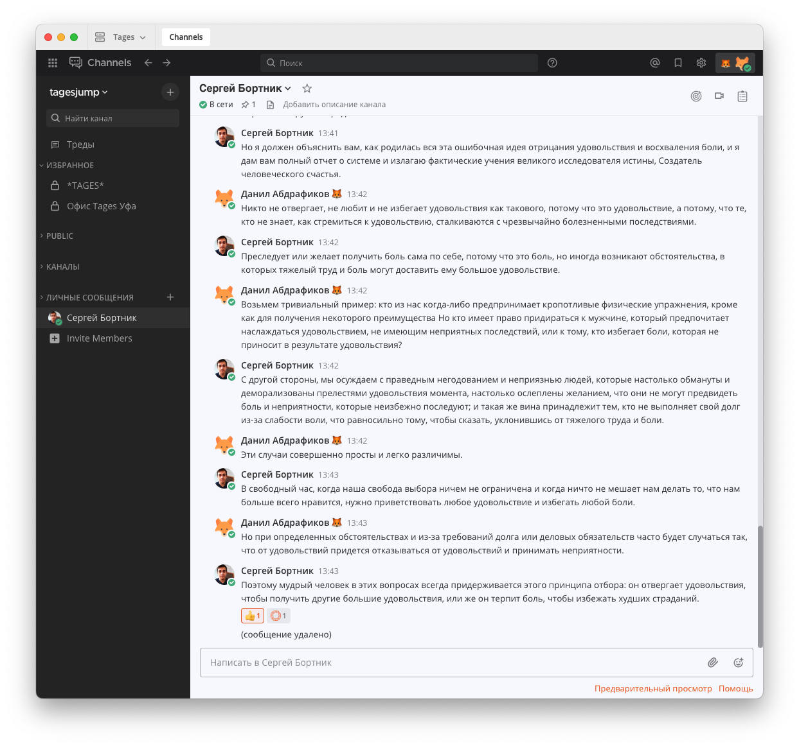

# Tages Mattermost

Communication with the team has never been so pleasant before with corporate themes in two versions - light and dark.

## How to apply theme

Go to `Settings` -> `View` -> `Theme` -> `Change` and apply the theme.

## Light



```json
{
  "sidebarBg": "#272727",
  "sidebarText": "#e2e2e2",
  "sidebarUnreadText": "#e2e2e2",
  "sidebarTextHoverBg": "#383838",
  "sidebarTextActiveBorder": "#ea5915",
  "sidebarTextActiveColor": "#e2e2e2",
  "sidebarHeaderBg": "#272727",
  "sidebarHeaderTextColor": "#f1f1f3",
  "onlineIndicator": "#43b581",
  "awayIndicator": "#faa61a",
  "dndIndicator": "#f04747",
  "mentionBg": "#ea5915",
  "mentionColor": "#e2e2e2",
  "centerChannelBg": "#f8f9fe",
  "centerChannelColor": "#343434",
  "newMessageSeparator": "#ea5915",
  "linkColor": "#ea5915",
  "buttonBg": "#ea5915",
  "buttonColor": "#ffffff",
  "errorTextColor": "#b80d10",
  "mentionHighlightBg": "#fff4f4",
  "mentionHighlightLink": "#ea5915",
  "codeTheme": "monokai",
  "mentionBj": "#ea5915",
  "sidebarTeamBarBg": "#1f2023"
}
```

# Dark


```json
{
  "sidebarBg": "#272727",
  "sidebarText": "#e2e2e2",
  "sidebarUnreadText": "#e2e2e2",
  "sidebarTextHoverBg": "#383838",
  "sidebarTextActiveBorder": "#ffb598",
  "sidebarTextActiveColor": "#e2e2e2",
  "sidebarHeaderBg": "#272727",
  "sidebarHeaderTextColor": "#f1f1f3",
  "onlineIndicator": "#43b581",
  "awayIndicator": "#faa61a",
  "dndIndicator": "#f04747",
  "mentionBg": "#ffdbcd",
  "mentionColor": "#5c1a00",
  "centerChannelBg": "#222222",
  "centerChannelColor": "#e2e2e2",
  "newMessageSeparator": "#ffdbcd",
  "linkColor": "#ffb598",
  "buttonBg": "#ffb598",
  "buttonColor": "#5c1a00",
  "errorTextColor": "#b80d10",
  "mentionHighlightBg": "#ffb598",
  "mentionHighlightLink": "#5c1a00",
  "codeTheme": "monokai",
  "mentionBj": "#ffdbcd",
  "sidebarTeamBarBg": "#1f2023"
}
```